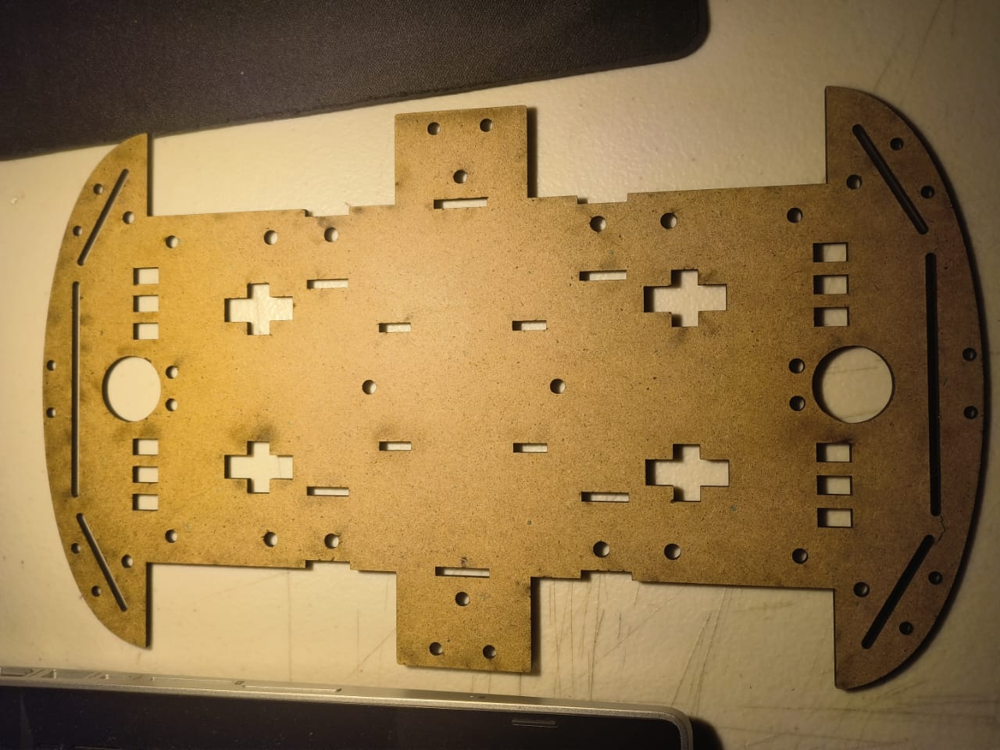
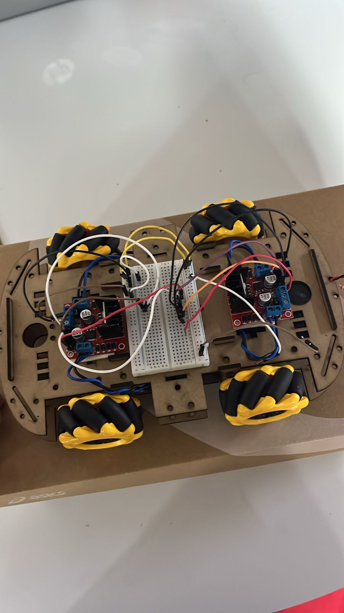

# 📚 Proyecto 1


## 1) Resumen

- **Nombre del proyecto:** _Carro con llantas omnidireccionales_  
- **Equipo / Autor(es):** _Juan Manuel Gaona Serrano_  
- **Curso / Asignatura:** _Introducción a la mecatronica_  
- **Fecha:** _17/10/2025_  
- **Descripción breve:** _En este proyecto realizamos un carro control remoto con contorl de xbox y ruedas omnidireccionales._

---

## 2) Objetivos

- **General:** _Crear un carro para competir en un torneo de futbol._
- **Específicos:**
  - _Código de conexión a xbox_
  - _Diseño en 3D_
  - _Código de llantas omnidereccionales_

## 3) Alcance y Exclusiones

- **Incluye:** _Codigo para conectar el control de xbox a ESP32. Modelo 3d de las partes del carro. Codigo de movimiento llantas omniderrcionales._
- **No incluye:** _La conexión del carro._

---

## 4) Requisitos

**Software**
- _Solidwords_
- _C++_

**Hardware (si aplica)**
- _ESP32_
- _Control de xbox_
- _Protoboard_
- _Resistencias, cables_
- _4 pilas recargables tipo C_
- _4 llantas omniderccionales_
- _4 motores DC 3_

**Conocimientos previos**
- _Programación básica_
- _Electrónica básica_
- _Diseño en 3d basico_

---

## 5) Instalación

### Codigo para conectar la placa ESP32 a el control de xbox para mover los cuatro motores

```bash

// ====== Control 4xM con Xbox (Bluepad32 + ESP32) ======
#include <Bluepad32.h>

// ================== Pines actualizados ==================
// Trasero Izquierdo (RL)
#define MI1 12
#define MI2 14
// Trasero Derecho (RR)
#define MD1 27
#define MD2 26
// Delantero Derecho (FR)
#define MI3 5
#define MI4 18
// Delantero Izquierdo (FL)
#define MD3 17
#define MD4 16

// === (OPCIONAL) Pines de ENABLE del driver ===
// L298N/L293D: ENA habilita un lado, ENB el otro.
// Si tu placa ya trae jumpers a 5V, puedes comentar estas 3 líneas:
#define ENA 32
#define ENB 33
#define USE_ENABLE_PINS 1

// === (OPCIONAL) TB6612FNG (descomenta si lo usas) ===
// #define STBY 25   // poner HIGH
// #define USE_TB6612 1

const int motores[] = { MI1, MI2, MD1, MD2, MI3, MI4, MD3, MD4 };

// ======== Bluepad32 ========
GamepadPtr pads[BP32_MAX_GAMEPADS];

// Deadzone más chica
const int DEADZONE = 80;

// ================== PROTOTIPOS ==================
void avanza();
void atras();
void izquierda();
void derecha();
void diagonal_derecha();
void diagonal_izquierda();
void horizontal_derecha();
void horizontal_izquierda();
void giro_rotacional();
void detener();

// ================== CALLBACKS BLUEPAD ==================
void onConnectedGamepad(GamepadPtr gp) {
  Serial.println("Gamepad conectado!");
  for (int i = 0; i < BP32_MAX_GAMEPADS; i++) {
    if (!pads[i]) { pads[i] = gp; break; }
  }
}
void onDisconnectedGamepad(GamepadPtr gp) {
  Serial.println("Gamepad desconectado!");
  for (int i = 0; i < BP32_MAX_GAMEPADS; i++) {
    if (pads[i] == gp) { pads[i] = nullptr; break; }
  }
}

// ================== SETUP ==================
void setup() {
  Serial.begin(115200);

  for (int i = 0; i < 8; i++) pinMode(motores[i], OUTPUT);
  detener();

  // Habilita driver
  #ifdef USE_TB6612
    pinMode(STBY, OUTPUT);
    digitalWrite(STBY, HIGH);   // TB6612: salir de standby
  #endif
  #ifdef USE_ENABLE_PINS
    pinMode(ENA, OUTPUT);
    pinMode(ENB, OUTPUT);
    digitalWrite(ENA, HIGH);    // habilita lado A (puedes usar PWM luego)
    digitalWrite(ENB, HIGH);    // habilita lado B
  #endif

  BP32.setup(&onConnectedGamepad, &onDisconnectedGamepad);
  BP32.enableNewBluetoothConnections(true);

  Serial.println("Listo. Motores + Bluepad32 inicializados.");
  Serial.println("Pon el control de Xbox en modo vinculación (botón pair).");
}

// ================== LOOP ==================
void loop() {
  BP32.update();

  bool hayAccion = false;

  for (int i = 0; i < BP32_MAX_GAMEPADS; i++) {
    GamepadPtr gp = pads[i];
    if (!gp || !gp->isConnected()) continue;

    int lx = gp->axisX();   // -511 .. 511
    int ly = gp->axisY();
    int rx = gp->axisRX();

    // Debug básico
    static uint32_t tLast = 0;
    if (millis() - tLast > 250) {
      tLast = millis();
      Serial.print("LX:"); Serial.print(lx);
      Serial.print("  LY:"); Serial.print(ly);
      Serial.print("  RX:"); Serial.print(rx);
      Serial.print("  DPad:"); Serial.println(gp->dpad(), HEX);
    }

    // Botón B: test rápido para comprobar que el driver recibe señal
    if (gp->b()) {
      Serial.println("TEST: avanza 1s");
      avanza();
      delay(1000);
      detener();
      delay(200);
      hayAccion = true;
      break;
    }

    // Botón A: detener
    if (gp->a()) { Serial.println("DETENER"); detener(); hayAccion = true; break; }

    // D-Pad: acciones discretas prioritarias
    uint8_t d = gp->dpad();
    if (d) {
      if (d & DPAD_UP && d & DPAD_RIGHT)      { Serial.println("DIAG DER"); diagonal_derecha(); }
      else if (d & DPAD_UP && d & DPAD_LEFT)  { Serial.println("DIAG IZQ"); diagonal_izquierda(); }
      else if (d & DPAD_RIGHT)                { Serial.println("HORIZ DER"); horizontal_derecha(); }
      else if (d & DPAD_LEFT)                 { Serial.println("HORIZ IZQ"); horizontal_izquierda(); }
      else if (d & DPAD_UP)                   { Serial.println("AVANZA"); avanza(); }
      else if (d & DPAD_DOWN)                 { Serial.println("ATRAS"); atras(); }
      hayAccion = true;
      break;
    }

    // Sticks analógicos
    bool movY = abs(ly) > DEADZONE;
    bool movX = abs(lx) > DEADZONE;
    bool rot  = abs(rx) > DEADZONE;

    if (rot) {
      Serial.println(rx > 0 ? "GIRO ->" : "GIRO <-");
      giro_rotacional();  // si quieres sentido opuesto, crea otra función invertida
      hayAccion = true;
      break;
    }

    if (movY && !movX) {
      Serial.println(ly < 0 ? "AVANZA" : "ATRAS");
      if (ly < 0) avanza(); else atras();
      hayAccion = true;
      break;
    }

    if (movX && !movY) {
      Serial.println(lx > 0 ? "HORIZ DER" : "HORIZ IZQ");
      if (lx > 0) horizontal_derecha(); else horizontal_izquierda();
      hayAccion = true;
      break;
    }

    if (movX && movY) {
      Serial.println(lx > 0 ? "DIAG DER" : "DIAG IZQ");
      if (lx > 0) diagonal_derecha(); else diagonal_izquierda();
      hayAccion = true;
      break;
    }
  }

  if (!hayAccion) detener();

  delay(10);
}

// ================== FUNCIONES DE CONTROL ==================
void MIARRIBA1() { digitalWrite(MI1, HIGH); digitalWrite(MI2, LOW); }
void MIABAJO1()  { digitalWrite(MI3, HIGH); digitalWrite(MI4, LOW); }
void MDARRIBA1() { digitalWrite(MD1, HIGH); digitalWrite(MD2, LOW); }
void MDABAJO1()  { digitalWrite(MD3, HIGH); digitalWrite(MD4, LOW); }

void MIARRIBA0() { digitalWrite(MI1, LOW); digitalWrite(MI2, HIGH); }
void MIABAJO0()  { digitalWrite(MI3, LOW); digitalWrite(MI4, HIGH); }
void MDARRIBA0() { digitalWrite(MD1, LOW); digitalWrite(MD2, HIGH); }
void MDABAJO0()  { digitalWrite(MD3, LOW); digitalWrite(MD4, HIGH); }

void avanza() { MIARRIBA1(); MIABAJO1(); MDARRIBA1(); MDABAJO1(); }
void atras()  { MIARRIBA0(); MIABAJO0(); MDARRIBA0(); MDABAJO0(); }
void izquierda() {
  MIARRIBA0(); MIABAJO1();
  MDARRIBA0(); MDABAJO1();
}
void derecha() {
  MIARRIBA1(); MIABAJO0();
  MDARRIBA0(); MDABAJO1();
}
void diagonal_derecha() {
  digitalWrite(MI1, HIGH); digitalWrite(MI2, LOW);
  digitalWrite(MD1, LOW);  digitalWrite(MD2, LOW);
  digitalWrite(MI3, LOW);  digitalWrite(MI4, LOW);
  digitalWrite(MD3, HIGH); digitalWrite(MD4, LOW);
}
void diagonal_izquierda() {
  digitalWrite(MI1, LOW);  digitalWrite(MI2, LOW);
  digitalWrite(MD1, HIGH); digitalWrite(MD2, LOW);
  digitalWrite(MI3, HIGH); digitalWrite(MI4, LOW);
  digitalWrite(MD3, LOW);  digitalWrite(MD4, LOW);
}
void horizontal_derecha() {
  digitalWrite(MI1, HIGH); digitalWrite(MI2, LOW);
  digitalWrite(MD1, LOW);  digitalWrite(MD2, HIGH);
  digitalWrite(MI3, LOW);  digitalWrite(MI4, HIGH);
  digitalWrite(MD3, HIGH); digitalWrite(MD4, LOW);
}
void horizontal_izquierda() {
  digitalWrite(MI1, LOW);  digitalWrite(MI2, HIGH);
  digitalWrite(MD1, HIGH); digitalWrite(MD2, LOW);
  digitalWrite(MI3, HIGH); digitalWrite(MI4, LOW);
  digitalWrite(MD3, LOW);  digitalWrite(MD4, HIGH);
}
void giro_rotacional() {
  digitalWrite(MI1, HIGH); digitalWrite(MI2, LOW);
  digitalWrite(MD1, LOW);  digitalWrite(MD2, HIGH);
  digitalWrite(MI3, HIGH); digitalWrite(MI4, LOW);
  digitalWrite(MD3, LOW);  digitalWrite(MD4, HIGH);
}
void detener() {
  for (int i = 0; i < 8; i++) digitalWrite(motores[i], LOW);
}


```

[Video Uso del programa](https://iberopuebla-my.sharepoint.com/:v:/g/personal/204137_iberopuebla_mx/EYeV4WCa9v9Mh1uBhRuzwf4B8_sVJnS0BT80nm48vKNWpA?nav=eyJyZWZlcnJhbEluZm8iOnsicmVmZXJyYWxBcHAiOiJPbmVEcml2ZUZvckJ1c2luZXNzIiwicmVmZXJyYWxBcHBQbGF0Zm9ybSI6IldlYiIsInJlZmVycmFsTW9kZSI6InZpZXciLCJyZWZlcnJhbFZpZXciOiJNeUZpbGVzTGlua0NvcHkifX0&e=oKghVj)

### Código para el movimiento de las llantas omnidireccionales

```bash

// ====== Control 4xM con Xbox (Bluepad32 + ESP32) ======
#include <Bluepad32.h>

// ================== Pines actualizados ==================
// Trasero Izquierdo (RL)
#define MI1 12
#define MI2 14
// Trasero Derecho (RR)
#define MD1 27
#define MD2 26
// Delantero Derecho (FR)
#define MI3 5
#define MI4 18
// Delantero Izquierdo (FL)
#define MD3 17
#define MD4 16

// === (OPCIONAL) Pines de ENABLE del driver ===
// L298N/L293D: ENA habilita un lado, ENB el otro.
// Si tu placa ya trae jumpers a 5V, puedes comentar estas 3 líneas:
#define ENA 32
#define ENB 33
#define USE_ENABLE_PINS 1

// === (OPCIONAL) TB6612FNG (descomenta si lo usas) ===
// #define STBY 25   // poner HIGH
// #define USE_TB6612 1

const int motores[] = { MI1, MI2, MD1, MD2, MI3, MI4, MD3, MD4 };

// ======== Bluepad32 ========
GamepadPtr pads[BP32_MAX_GAMEPADS];

// Deadzone más chica
const int DEADZONE = 80;

// ================== PROTOTIPOS ==================
void avanza();
void atras();
void izquierda();
void derecha();
void diagonal_derecha();
void diagonal_izquierda();
void horizontal_derecha();
void horizontal_izquierda();
void giro_rotacional();
void detener();

// ================== CALLBACKS BLUEPAD ==================
void onConnectedGamepad(GamepadPtr gp) {
  Serial.println("Gamepad conectado!");
  for (int i = 0; i < BP32_MAX_GAMEPADS; i++) {
    if (!pads[i]) { pads[i] = gp; break; }
  }
}
void onDisconnectedGamepad(GamepadPtr gp) {
  Serial.println("Gamepad desconectado!");
  for (int i = 0; i < BP32_MAX_GAMEPADS; i++) {
    if (pads[i] == gp) { pads[i] = nullptr; break; }
  }
}

// ================== SETUP ==================
void setup() {
  Serial.begin(115200);

  for (int i = 0; i < 8; i++) pinMode(motores[i], OUTPUT);
  detener();

  // Habilita driver
  #ifdef USE_TB6612
    pinMode(STBY, OUTPUT);
    digitalWrite(STBY, HIGH);   // TB6612: salir de standby
  #endif
  #ifdef USE_ENABLE_PINS
    pinMode(ENA, OUTPUT);
    pinMode(ENB, OUTPUT);
    digitalWrite(ENA, HIGH);    // habilita lado A (puedes usar PWM luego)
    digitalWrite(ENB, HIGH);    // habilita lado B
  #endif

  BP32.setup(&onConnectedGamepad, &onDisconnectedGamepad);
  BP32.enableNewBluetoothConnections(true);

  Serial.println("Listo. Motores + Bluepad32 inicializados.");
  Serial.println("Pon el control de Xbox en modo vinculación (botón pair).");
}

// ================== LOOP ==================
void loop() {
  BP32.update();

  bool hayAccion = false;

  for (int i = 0; i < BP32_MAX_GAMEPADS; i++) {
    GamepadPtr gp = pads[i];
    if (!gp || !gp->isConnected()) continue;

    int lx = gp->axisX();   // -511 .. 511
    int ly = gp->axisY();
    int rx = gp->axisRX();

    // Debug básico
    static uint32_t tLast = 0;
    if (millis() - tLast > 250) {
      tLast = millis();
      Serial.print("LX:"); Serial.print(lx);
      Serial.print("  LY:"); Serial.print(ly);
      Serial.print("  RX:"); Serial.print(rx);
      Serial.print("  DPad:"); Serial.println(gp->dpad(), HEX);
    }

    // Botón B: test rápido para comprobar que el driver recibe señal
    if (gp->b()) {
      Serial.println("TEST: avanza 1s");
      avanza();
      delay(1000);
      detener();
      delay(200);
      hayAccion = true;
      break;
    }

    // Botón A: detener
    if (gp->a()) { Serial.println("DETENER"); detener(); hayAccion = true; break; }

    // D-Pad: acciones discretas prioritarias
    uint8_t d = gp->dpad();
    if (d) {
      if (d & DPAD_UP && d & DPAD_RIGHT)      { Serial.println("DIAG DER"); diagonal_derecha(); }
      else if (d & DPAD_UP && d & DPAD_LEFT)  { Serial.println("DIAG IZQ"); diagonal_izquierda(); }
      else if (d & DPAD_RIGHT)                { Serial.println("HORIZ DER"); horizontal_derecha(); }
      else if (d & DPAD_LEFT)                 { Serial.println("HORIZ IZQ"); horizontal_izquierda(); }
      else if (d & DPAD_UP)                   { Serial.println("AVANZA"); avanza(); }
      else if (d & DPAD_DOWN)                 { Serial.println("ATRAS"); atras(); }
      hayAccion = true;
      break;
    }

    // Sticks analógicos
    bool movY = abs(ly) > DEADZONE;
    bool movX = abs(lx) > DEADZONE;
    bool rot  = abs(rx) > DEADZONE;

    if (rot) {
      Serial.println(rx > 0 ? "GIRO ->" : "GIRO <-");
      giro_rotacional();  // si quieres sentido opuesto, crea otra función invertida
      hayAccion = true;
      break;
    }

    if (movY && !movX) {
      Serial.println(ly < 0 ? "AVANZA" : "ATRAS");
      if (ly < 0) avanza(); else atras();
      hayAccion = true;
      break;
    }

    if (movX && !movY) {
      Serial.println(lx > 0 ? "HORIZ DER" : "HORIZ IZQ");
      if (lx > 0) horizontal_derecha(); else horizontal_izquierda();
      hayAccion = true;
      break;
    }

    if (movX && movY) {
      Serial.println(lx > 0 ? "DIAG DER" : "DIAG IZQ");
      if (lx > 0) diagonal_derecha(); else diagonal_izquierda();
      hayAccion = true;
      break;
    }
  }

  if (!hayAccion) detener();

  delay(10);
}

// ================== FUNCIONES DE CONTROL ==================
void MIARRIBA1() { digitalWrite(MI1, HIGH); digitalWrite(MI2, LOW); }
void MIABAJO1()  { digitalWrite(MI3, HIGH); digitalWrite(MI4, LOW); }
void MDARRIBA1() { digitalWrite(MD1, HIGH); digitalWrite(MD2, LOW); }
void MDABAJO1()  { digitalWrite(MD3, HIGH); digitalWrite(MD4, LOW); }

void MIARRIBA0() { digitalWrite(MI1, LOW); digitalWrite(MI2, HIGH); }
void MIABAJO0()  { digitalWrite(MI3, LOW); digitalWrite(MI4, HIGH); }
void MDARRIBA0() { digitalWrite(MD1, LOW); digitalWrite(MD2, HIGH); }
void MDABAJO0()  { digitalWrite(MD3, LOW); digitalWrite(MD4, HIGH); }

void avanza() { MIARRIBA1(); MIABAJO1(); MDARRIBA1(); MDABAJO1(); }
void atras()  { MIARRIBA0(); MIABAJO0(); MDARRIBA0(); MDABAJO0(); }
void izquierda() {
  MIARRIBA0(); MIABAJO1();
  MDARRIBA0(); MDABAJO1();
}
void derecha() {
  MIARRIBA1(); MIABAJO0();
  MDARRIBA0(); MDABAJO1();
}
void diagonal_derecha() {
  digitalWrite(MI1, HIGH); digitalWrite(MI2, LOW);
  digitalWrite(MD1, LOW);  digitalWrite(MD2, LOW);
  digitalWrite(MI3, LOW);  digitalWrite(MI4, LOW);
  digitalWrite(MD3, HIGH); digitalWrite(MD4, LOW);
}
void diagonal_izquierda() {
  digitalWrite(MI1, LOW);  digitalWrite(MI2, LOW);
  digitalWrite(MD1, HIGH); digitalWrite(MD2, LOW);
  digitalWrite(MI3, HIGH); digitalWrite(MI4, LOW);
  digitalWrite(MD3, LOW);  digitalWrite(MD4, LOW);
}
void horizontal_derecha() {
  digitalWrite(MI1, HIGH); digitalWrite(MI2, LOW);
  digitalWrite(MD1, LOW);  digitalWrite(MD2, HIGH);
  digitalWrite(MI3, LOW);  digitalWrite(MI4, HIGH);
  digitalWrite(MD3, HIGH); digitalWrite(MD4, LOW);
}
void horizontal_izquierda() {
  digitalWrite(MI1, LOW);  digitalWrite(MI2, HIGH);
  digitalWrite(MD1, HIGH); digitalWrite(MD2, LOW);
  digitalWrite(MI3, HIGH); digitalWrite(MI4, LOW);
  digitalWrite(MD3, LOW);  digitalWrite(MD4, HIGH);
}
void giro_rotacional() {
  digitalWrite(MI1, HIGH); digitalWrite(MI2, LOW);
  digitalWrite(MD1, LOW);  digitalWrite(MD2, HIGH);
  digitalWrite(MI3, HIGH); digitalWrite(MI4, LOW);
  digitalWrite(MD3, LOW);  digitalWrite(MD4, HIGH);
}
void detener() {
  for (int i = 0; i < 8; i++) digitalWrite(motores[i], LOW);
}

```

[Video Uso del programa](https://iberopuebla-my.sharepoint.com/:v:/g/personal/204137_iberopuebla_mx/EaCq6E4sU_FPqtONr8BLsHYB1tWUHDCg-NB5_AKIfsVijg?nav=eyJyZWZlcnJhbEluZm8iOnsicmVmZXJyYWxBcHAiOiJPbmVEcml2ZUZvckJ1c2luZXNzIiwicmVmZXJyYWxBcHBQbGF0Zm9ybSI6IldlYiIsInJlZmVycmFsTW9kZSI6InZpZXciLCJyZWZlcnJhbFZpZXciOiJNeUZpbGVzTGlua0NvcHkifX0&e=LKZvRU)

[Video 2](https://iberopuebla-my.sharepoint.com/:v:/g/personal/204137_iberopuebla_mx/EXijygiCvgRItuFI75qH-JIBp3y6WQIeAy_whmyff9KFBA?nav=eyJyZWZlcnJhbEluZm8iOnsicmVmZXJyYWxBcHAiOiJPbmVEcml2ZUZvckJ1c2luZXNzIiwicmVmZXJyYWxBcHBQbGF0Zm9ybSI6IldlYiIsInJlZmVycmFsTW9kZSI6InZpZXciLCJyZWZlcnJhbFZpZXciOiJNeUZpbGVzTGlua0NvcHkifX0&e=qj5vqy)

### Diseño de la base para el carro 

Diseñamos el carro en solidwords dejando las medidas de las llantas y colocando agujeros en toda la pieza con la finalidad de pasar cables, además de dejar ranuras donde se va a ensamblar el carro usando unas paredes que se le adaptaron unos orificios para conectar los motores con la estructura usando tornillos.

### Modelos para corte laser en dxf
[Base carro.DXF](https://iberopuebla-my.sharepoint.com/:u:/g/personal/204137_iberopuebla_mx/EX_7gDgkMvBNk6BTuQm6v-QBypBrTyEOa_80XfFAER95mA?e=IGbSsc)

[Paredes carro.DXF](https://iberopuebla-my.sharepoint.com/:u:/g/personal/204137_iberopuebla_mx/Ee6VNNM0-qxAm3DD7lYb6b8BdIyZ1gJzNXuHWEXGNgl2mA?e=WnICTr)



### Video de resultado final 

[Resultado final](https://iberopuebla-my.sharepoint.com/:v:/g/personal/204137_iberopuebla_mx/Ea5egYiSl6RBmgLrrm2d77UBn8WQOTbz9cZF5FC3e_s74g?nav=eyJyZWZlcnJhbEluZm8iOnsicmVmZXJyYWxBcHAiOiJPbmVEcml2ZUZvckJ1c2luZXNzIiwicmVmZXJyYWxBcHBQbGF0Zm9ybSI6IldlYiIsInJlZmVycmFsTW9kZSI6InZpZXciLCJyZWZlcnJhbFZpZXciOiJNeUZpbGVzTGlua0NvcHkifX0&e=a7G7kG)


